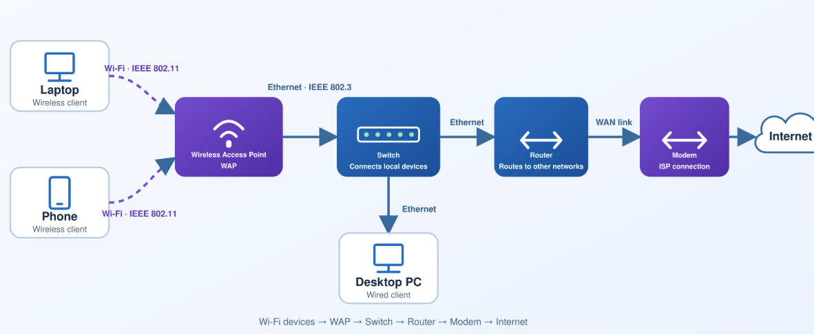

# Network Layers and Encapsulation


### Application Layer
`[data]`

### Transport Layer

Transport Layer -  `[TCP segment [data]]`<br>
What you see here: Source port, destination port, segment sequence numbers, flow control data.<br>
(HTTP, gRPC, WebSocket, etc.) is built on top of TCP or UDP.<br>
Below Transport layer no concept of Ports.

### Network Layer

Network Layer - `[IP packet [TCP segment [data]]]`<br>
What you see here: Source IP, destination IP, TTL, routing information.<br>
Key Protocol: IP (Internet Protocol).<br>
Routers operate at this layer.

### Data Link Layer

Data Link Layer - `[Frame [IP packet [TCP segment [data]]]]`<br>
What you see here: Source MAC, destination MAC, frame.<br>
Key Protocols: Ethernet, Wi-Fi.<br>
Switches operate at this layer.<br>
A switch forward frame using the MAC address of the interface.

### Physical Layer

Physical Layer - 10101010101010...<br>
Converts digital bits (0s and 1s) into physical signals and vice versa.

Each Layer adds its own header.

```
┌────────────────────────────────────────────────────────┐
│                      FRAME (Layer 2)                   │
│                   Dest MAC | Src MAC |                 │
│           ┌────────────────────────────────────┐       │
│           │          PACKET (Layer 3)          │       │
│           │        Dest IP | Src IP |          │       │
│           │   ┌──────────────────────────┐     │       │
│           │   │     SEGMENT (Layer 4)    │     │       │
│           │   │  Dest Port | Src Port |  │     │       │
│           │   │   ┌──────────────────┐   │     │       │
│           │   │   │   DATA (L5-L7)   │   │     │       │
│           │   │   │  (JSON payload)  │   │     │       │
│           │   │   └──────────────────┘   │     │       │
│           │   └──────────────────────────┘     │       │
│           └────────────────────────────────────┘       │
└────────────────────────────────────────────────────────┘
```

## Application to Physical Layer Flow

Application (L7)	Application sends a POST request with a JSON body.

Presentation (L6)	JSON object is serialized into a flat byte string (e.g., UTF-8).

Session (L5)	Checks if a TCP session exists. If not, pauses and initiates a TCP 3-way handshake (SYN → SYN-ACK → ACK). TLS handshake also happens here.

Transport (L4)	Data is placed into a TCP segment with destination port 443 (HTTPS).

Network (L3)	Segment is placed into an IP packet with source and destination IP addresses (resolved via DNS)

Data Link (L2)	Packet is placed into a frame with source and destination MAC addresses (resolved via ARP)

Physical (L1)	Frame is converted to bits → transmitted as electrical signals / radio waves / light

# IP Packet

A packet is a Layer 3 (Network Layer) concept.<br>
IP packet = data + destination IP address + source IP address + headers.

Inside that packet, there are also things like ports, TCP/transport layer info, and the actual data/payload — but at network layer, none of that matters. <br>
A router doesn't care what's inside the packet (ports, application data); it only cares about getting the packet to the right destination IP.

When a device gets connected to internet, an IP address is assigned to that device via Dynamic Host Configuration Protocol(DHCP).<br>
DHCP server runs as software inside the router and router is responsible for assigning the IP address.<br>
When a device wants to connect to internet, it broadcasts DHCP request.

## IPv4 Address

An IPv4 address has 2 parts:<br>
Network portion: Which network/subnet does this device belong to?<br>
Host portion: Which particular device/interface is this within that network?

Example, `192.168.254.0/24` is a subnet(subnet means group of IPs)<br>
`/24` means the first 24 bits (i.e., the first 3 bytes: `192.168.254`) are the network portion.<br>
The remaining 8 bits (the last byte) are the host portion. With 8 host bits → 2⁸ = 256 total addresses.

## What is a Subnet?

A device has an IP address like `192.168.31.109`, how does it know which other IP addresses are on its local network and which ones are remote?<br>
"Is `192.168.31.50` part of my local network, or is it somewhere else?"<br>
The subnet mask gives the device that information.

The subnet mask is applied using a bitwise AND operation between the IP address and the subnet mask.

If the destination IP is in the same subnet → the sender can use the MAC address to send the packet directly.<br>
If the destination IP is in a different subnet → the sender must forward the packet to default gateway/router.

The Default Gateway is the device (usually a router) that a host sends packets to when the destination is outside its own subnet.

## MTU (Maximum Transmission Unit)

maximum size of a single frame that can be transmitted over a network.

## IP Fragmentation

When an IP packet is larger than the MTU of the network it must pass through, it cannot fit into a single frame.<br>
There are 2 options to deal with this:

### Don't Fragment(DF) bit:

if DF bit is set, and packet is too large, router will not fragment it.<br>
Instead router sends back ICMP message saying "MTU too small / packet too large."<br>
The sender is then responsible for resending a smaller packet.

### Fragment the packet

IP packet size = 2000 bytes, but MTU = 1500 bytes.<br>
The packet gets split:<br>
Fragment 1 → 1500 bytes → goes into Frame 1<br>
Fragment 2 → 500 bytes → goes into Frame 2<br>
These fragments are sent as separate frames.

## Time To Live (TTL)

The problem TTL solves.<br>
IP is a stateless protocol — routers do not remember which packets they've seen before.<br>
a packet could theoretically get stuck in a routing loop (Router A → Router B → Router C → back to Router A → ...) and circulate forever.

TTL Prevents packets from looping forever in the network.<br>
When a packet is sent, the sender sets an initial TTL value (commonly 128 or similar).<br>
Each router (hop) that processes the packet decrements TTL by 1.<br>
The router that decrements TTL to 0, Drops the packet (does not forward it further)

## How Traceroute Works (Using TTL)

`traceroute` command show you the path your IP packets take from your computer to a destination.

Each time, the packet survives one hop further before expiring, revealing the next router's IP address.<br>
The first router decrements it to 0, drops it, and sends back an ICMP "TTL exceeded" message — revealing its own IP address.

Limitation: Some routers/firewalls disable ICMP responses. When this happens, `traceroute` shows " * " (dots) for that hop, since no response is received.

## What is ICMP?

ICMP is a Network Layer protocol used for sending informational and error messages between hosts.<br>
`ping` – checks if a host is reachable.<br>
`traceroute` – maps the path a packet takes to reach a destination.

Since ICMP operates at Network layer, it only deals with source IP and destination IP — there is no concept of ports.<br>
This means we dont need a listener or an open port to receive ICMP messages.<br>
`ping` and `traceroute` use IP packets, not TCP or UDP, and don't require any port to be open.

Some routers/firewalls block ICMP for security reasons.<br>
In that case, `traceroute` may show "*" symbols for that hop.<br>
Why `ping` Might Fail Even When the Host is Alive is because a router along the path is blocking or dropping ICMP packets.<br>
Ping is just an IP packet carrying an ICMP message.

## TCP blackhole

A TCP connection is successfully established via the TCP handshake.<br>
When we start sending data(larger packets) and the packet has the "Don't Fragment" flag set:<br>
If a router along the path has a smaller MTU (Maximum Transmission Unit) and the packet is too large, the router needs to tell the sender to fragment the packet.the router sends back an ICMP "Fragmentation Needed" message asking the sender to reduce packet size.<br>
But if ICMP is blocked, this message never reaches the sender.<br>
The TCP connection shows as "open," but no data actually goes through.

# ARP

ARP is protocol which maps IP address to MAC address.

MAC address is assigned to the network interface of a device to uniquely identify a device in a local network.<br>
why not use IP for unique identification?<br>
1. Before a device even has an IP, it needs a MAC.<br>
when your laptop boots up with no IP yet, how does it ask the DHCP server for one?<br>
It broadcasts a DHCP request using its MAC address.<br>
2. IP addresses change; MAC addresses don't.<br>
DHCP reassigns IPs. You move your laptop to a different Wi-Fi network — new IP, same MAC.

## Communication within the same Subnet 

Host A (IP: `10.0.0.2`, MAC: AA) wants to send to Host B (IP: `10.0.0.5`, MAC: ??)

### Step 1 : your device checks if 10.0.0.5 local?

Host A applies the subnet mask to both IPs<br>
Determines: "Host `10.0.0.5` is on my subnet"<br>
Therefore, Host A can directly address Host B's MAC.<br>
Then Host A checks its own ARP cache table

### Step 2 – ARP cache Table Lookup:

Host A checks its ARP table: "Do I already know the MAC of `10.0.0.5`?"<br>
If not found → proceed to ARP broadcast

### Step 3 : ARP broadcast.

Host A broadcasts an ARP request.<br>
This is a broadcast Ethernet frame: destination MAC = `FF:FF:FF:FF:FF:FF` (all devices)<br>
The switch receives this broadcast request and forwards it to all physical ports on the local network.<br>
(Switch has a mapping of Physical switch port to Device MAC Address. A switch knows, that a particular MAC address is reachable through which physical port.)<br>
Switch broadcast the frame, every host on local network receives the frame.

### Step 4 : ARP Reply.

Every device checks, "Is this frame destined for me?", if not, then Ignore.<br>
Host B also receives the broadcast frame.<br>
Inside the IP packet it sees `10.0.0.5` and realizes "That's my IP".<br>
Host B knows its own MAC address.<br>
Host B prepares a Unicast ARP Reply.<br>
"10.0.0.5 is at B2:R4:IU:BB:BP:J9" and hand it to the Switch.

### Step 5 : Table update and Transmission.

Switch receives the unicast frame and hand it to Host A.<br>
Host A stores `10.0.0.5` → DD in its ARP table.

### Step 6 : Communication.

Now Host A can send Frames to Host B.<br>
Host A send Frame to the Switch.<br>
Switch receives it and check the MAC address, verify its Port to MAC mapping, and forwards the Frame directly to Host B.

## Communication on Different Subnet

Device A (`10.0.0.2`) wants to reach Server X (`1.2.3.4`) — on the other side of the internet

Device A checks through subnet mask if `1.2.3.4` belongs to local network?<br>
`1.2.3.4` does not.<br>
Therefore Device A must deliver this to its Default Gateway, and to hand it to router, Device A must know the MAC address of the router.<br>
So it finds router MAC address using ARP.<br>
The device already knows the Router IP : `10.0.0.101`<br>
So ARP Broadcast happens, Switch forwards the frame, Router sends ARP Reply, Switch hand it to the device.<br>
Now device knows the MAC address of the router.<br>
Now the device sends the Frame to the Switch and Switch forwards the frame to the Router.<br>
Router removes the layer 2 Frame, read the IP packet inside it and Check the destination IP.<br>
Checks its routing table.<br>
`1.2.3.4` is not a local network — it's a public internet address.<br>
But, the router cannot forward using a private IP (`10.0.0.2`) on the public internet.<br>
So here comes the Network Address Translation,<br>
Router replaces the source IP address in the packet: `10.0.0.4` (private) → `49.36.144.195` (router's public IP)<br>
Also assigns a port number to track the connection and stores entry in its NAT table.<br>
Chooses the best route and the next router, generally its the ISP's router.<br>
*(How the ISP knows where to forward the packets?)*<br>
Packet passes through many routers and switches across the internet, and eventually reaches `1.2.3.4`<br>
Reply is sent to the router's public IP `49.36.144.195`<br>
Router looks up its NAT table → translates back to `10.0.0.4` and forward response to Device A.

The default gateway/router is only used when the destination is outside device's local IP network.

### Border Gateway Protocol (BGP)
The Internet is not one network, it is thousands of independently managed networks.<br>
Jio / Airtel / Tata Communications, AWS, Google, universities and large enterprises each has its own routers, connection.<br>
BGP is the protocol that let these large networks on the Internet tell each other which IP address ranges they can reach.<br>
It runs between routers at network boundaries especially ISPs, cloud providers, CDNs, and very large companies, not between laptop and switch.<br>


# Network Interface Card (NIC) and MAC Address

NIC allows a device to connect to a network.<br>
A device can have multiple NICs and hence multiple MAC addresses.<br>
Wi-Fi NIC, connects to the Wifi.<br>
Ethernet NIC, connects to the router/switch using cable.<br>
We also have a loopback virtual interface(`127.0.0.1`) for communication in same machine, loopback has no real MAC because there's no physical wire involved.
Each Network interface has its own MAC address, so a MAC address belongs to a network interface, not to the device as a whole.<br>
`ifconfig` command can list all the network interfaces your device have.

Switch uses MAC address to deliver Frame to the right device.<br>
when a laptop boots up with no IP yet, It broadcasts a DHCP request using its MAC address, because that's the only identity it has at that point. The DHCP server(which is in router itself) replies to that MAC with "here's your new IP."

A machine/server can have multiple active NICs at the same time. Each NIC can connect to a different network and have its own IP address.<br>
Like one NIC for public/Internet-facing traffic, a separate NIC for internal/private network traffic (e.g., talking to a database server).<br>

For example,
```
eth0 — public/front-end network
IP: 203.0.113.10/24
Gateway: 203.0.113.1

eth1 — private/backend network
IP: 10.20.0.10/24
No default gateway needed
```
Server calls the database Destination: `10.20.0.50` 
The OS checks its routing table and sees that `10.20.0.50` matches: `10.20.0.0/24` → `eth1`
So it chooses `eth1` and source IP `10.20.0.10`.
ARPs for the database MAC address and sends the Ethernet frame through the backend switch directly to the database.
In this way, Firewalls can allow only the server’s private subnet to reach the DB port, such as PostgreSQL 5432.
If the Destination is outside the subnet, server uses `eth0` and source IP `203.0.113.10`, ARPs for the gateway/router’s MAC and sends the frame to the public router.

We know that a device can have several NICs (Wi-Fi, Ethernet, loopback, etc.) each with its own MAC address and it also means that each interface has its own IP.
So a single machine/server is simultaneously reachable at several different IPs at once.
Since a process runs on a particular IP address and port, therefore the process running on a server(Spring boot or NodeJS application) has to choose which of these IPs to bind itself to.
Loopback (`127.0.0.1`) is a way for two programs on the same machine to talk over the network stack without ever touching a NIC, switch.

“listening on an IP” means:
“Kernel, if a TCP packet arrives with this destination IP and this destination port, give the resulting connection to my process.”

If the application listening on `127.0.0.1:8080`, only packets from the same machine can reach reach the application.
If the application listening on `10.20.0.10:8080`, only packets which are sent to the private NIC can reach the application.
If the application listening on `203.0.113.10:8080`, only packets which are sent to the public NIC can reach the application.

**Listening on different IPs and Port combination does not mean that a process is running multiple times, process runs only once and we configure the application to listen on the network interfaces.**

**Why Listening on every interface is dangerous?**<br>
If the application listening on `0.0.0.0:8080`, it is basically listening to each network interface available in the machine, packets from anywhere can reach the application.
`0.0.0.0:8080` means, “Accept TCP connections sent to port 8080 on any IPv4 address currently assigned to this machine.”


## tcpdump

`tcpdump` is a command that can capture any protocol ARP, ICMP, IP, TCP, UDP, and more. Parses raw packets and displays them in a human-readable format.<br>
It can capture packets on a network interface like, `tcpdump -i en0 arp`<br>
It can filter traffic based on IP.

# Wireless Technology

Wifi(IEEE 802.11) is a family of protocols. It defines how devices communicate over radio waves, which frequencies to use, how to authenticate/encrypt(WPA2/WPA3).

A WAP (Wireless Access Point) is the device that implements Wi-fi protocol (IEEE 802.11) and provides wireless network access.<br>
It has a wireless radio on one side and usually an Ethernet interface on the other.

The phone/laptop's Wi-Fi NIC connects to the WAP wirelessly, and on the other end WAP is connected to the switch via an Ethernet cable.<br>
WAP receives 802.11 frames from the device and converts those frames into 802.3 ethernet frames, and hands it  to the switch.<br>
The switch doesn't know or care that from where this frame originated from? The switch does it typical job of  hand it to the respected MAC address.



Modem(Modulator Demodulator) is responsible for converting Radio signals into digital bits and vice versa.

In general, one Wi‑Fi router box often combines several of these roles:<br>
Modem + Router + switch + Wireless access point(WAP) + firewall + NAT + DHCP server

# How mobile data works
Mobile phones have cellular modem/radio network interface, which is a part of System on Chip(SoC), equivalent of Wi-Fi NIC or Ethernet NIC.<br>
Instead of a MAC address here we have,<br>
IMEI — identifies the physical device<br>
SIM — identifies your subscriber account with the carrier<br>
The radio talks to a cell tower.<br>
The mobile phone gets a private/carrier-assigned IP (often behind Carrier-Grade NAT, CGNAT — many phones share one public IP, same NAT concept as your home router, just at a much bigger scale)

# Hotspot

When you turn on your phone's hotspot, your phone temporarily plays the role your home router normally plays, WAP, router, NAT, firewall.