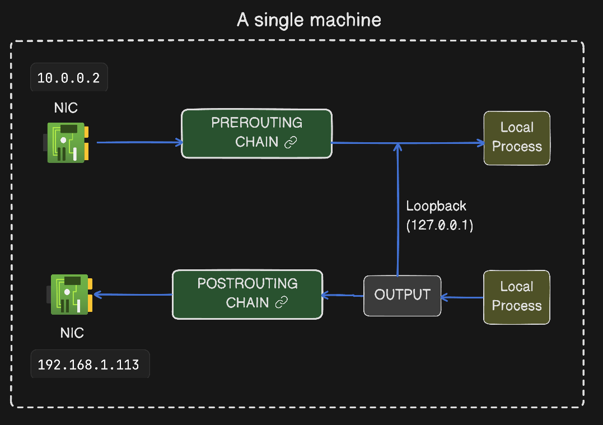

# iptables

Packets entered the system through NIC, even before it reaches to an application, the Linux kernel receives it first. 
`iptables` let us create rules which tell the kernel what to do with those packets. 
`iptables` is the command-line tool and Netfilter is the kernel subsystem that actually applies the rules.

Chains are sequences of rules and Packets pass through different chains depending on where they are in their journey.

Incoming Packet **(Src IP, Src Port, Dest IP, Dest Port)** enters via a network interface (Wi-Fi, Ethernet, etc.) 
It always goes first to the **PREROUTING** chain, here you can add rules to change where the packet goes. 
From PREROUTING there are two possible paths, 
**No destination change**: If there's a process listening on the destination port, the packet is delivered to that process. If no process is listening, the kernel sends back a TCP RESET. 
**Destination changed**: If a rule changes the destination IP (redirecting it elsewhere), the packet goes to **POSTROUTING** next, because it's now leaving the machine/network. 

When a packet leaves a process (e.g., sending an HTTP GET/POST request), it passes through the **OUTPUT** chain. 
After OUTPUT, it may go to **POSTROUTING** Chain if it's leaving the network to reach an external IP. 
If packet is send to 127.0.0.1 (localhost), it goes through OUTPUT and loops directly back to the process listening on same machine — this is called a loopback. 

## Port Redirection
An application is running at port 8080, using `iptables` we can redirect the traffic coming at port 80 to port 8080. 
A rule is added to the PREROUTING chain to change only the port (not the IP) from 80 → 8080. 
The kernel keeps track of this translation, so when the server replies (from port 8080), iptables automatically rewrites the reply's source port back to 80 — otherwise the original client would reject the reply as unexpected (since it sent the request to port 80, not 8080).

## IP Forwarding
Forwarding HTTP traffic to another machine 
**DNAT (Destination NAT)**: Changes the destination IP and/or port of a packet. 
**SNAT (Source NAT)**: Changes the source IP and/or port of a packet. 
### why DNAT only is not enough?
Client (`122.18.4.2`) sends a request to `10.0.0.2:80` 
Machine `10.0.0.2:80` has nothing running on port 80, the real server is on a different machine (`192.168.1.3:80`). 
PREROUTING rule changes the destination IP: `10.0.0.2` → `192.168.1.3` 
Packet arrives at `192.168.1.3`, gets processed.  
The reply is sent back to the source IP, which is still the original client (`122.18.4.2`), not machine `10.0.0.2`.  
The client (`122.18.4.2`) receives an unexpected reply from a machine it never contacted (`192.168.1.3`) and drops the packet.  
### SNAT fix
A POSTROUTING rule rewrites the source IP of the outgoing packet from the client's real IP to `10.0.0.2`.  
Now `192.168.1.3` replies to source IP `10.0.0.2`.  
`10.0.0.2` receives the reply and send to original client.
